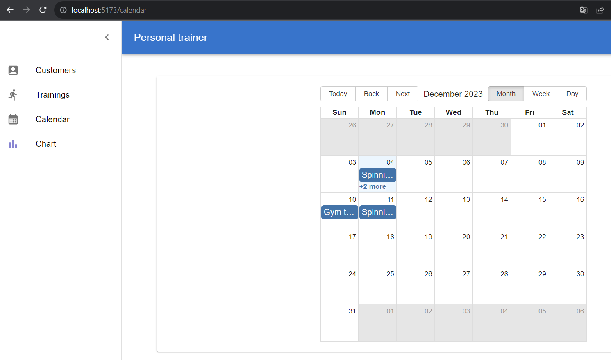

### About the project
The purpose of this project was to practice and improve my skills in frontend development, focusing on building responsive and interactive user interfaces. Throughout the development process, I worked with modern tools and libraries such as React, Vite, and Material UI.

### Used technologies
- React
- Vite
- Material UI (MUI)
- Ag-Grid
- Day.js & Moment.js
- Lodash
- React Big Calendar
- Recharts
- LocalForage
- Emotion

### Screenshots

